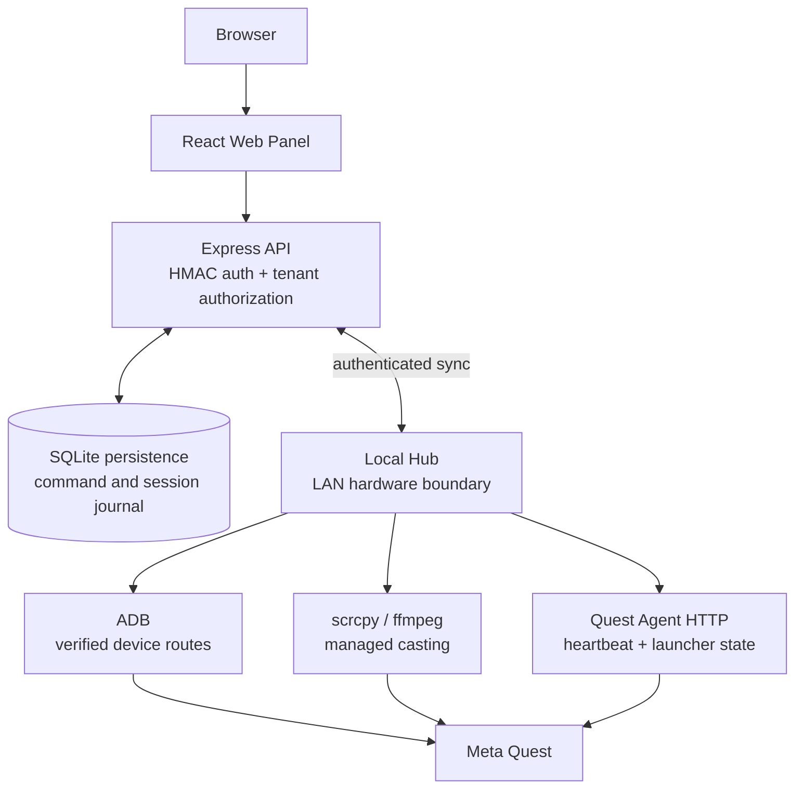

# BizonVR Operator

[](https://github.com/yarrobong/BizonVR-Operator/actions/workflows/ci.yml)

BizonVR Operator is a portfolio-scale MVP for running a Meta Quest fleet in a VR club. It gives an operator one web panel for devices, club rooms, sessions, diagnostics, APK provisioning, and casting. The interesting part is the hardware boundary: cloud orchestration stays separate from the LAN-local process that can actually reach a headset.

## What it does



The Express API owns authorization, durable state, command claiming, and session transitions. The Local Hub polls and reconciles typed commands, then runs ADB, scrcpy, and Quest Agent operations inside the club network. Cloud code never runs ADB or scrcpy directly, and the UI cannot submit arbitrary shell commands.

## Why this project is technically interesting

- Distributed Cloud API ↔ Local Hub orchestration across an unreliable LAN boundary.
- Typed device commands with idempotency keys, durable claims, leases, retries, and reconciliation.
- Tenant and club scope checks combined with subscription feature and device-limit enforcement.
- HMAC Bearer authentication for the Web API and per-Hub credentials for transport.
- Local Agent credential provisioning: the Hub keeps the raw credential locally while Cloud stores only its hash.
- Freshness and monotonic-timestamp checks for Quest Agent heartbeats.
- APK artifact identity and SHA-256 validation before ADB installation.
- ADB route recovery that keeps stable device identity separate from USB/Wi-Fi routes and IP addresses.
- Casting with one managed producer per Quest, bounded backpressure, fallback transport, and process cleanup.
- SQLite migrations and transactions for session, command, audit, and credential-scrubbing safety.
- React management UI, Kotlin Android Quest Agent, and automated Node/Gradle CI.

## Implemented capabilities

The current repository contains source and tests for:

- organizations, clubs, rooms, devices, Local Hubs, subscriptions, and audit logs;
- device health/status projections, Agent heartbeat ingestion, operator-call flow, and diagnostics;
- typed command creation, status transitions, cancellation, delivery claims, and result reconciliation;
- session start, pause, resume, extension, app switching, completion, and failure handling;
- app inventory and checksum-verified Quest Agent/APK installation commands;
- app launch/stop, launcher return, ADB repair/reconnect, and managed scrcpy casting;
- club-map and device-management screens built with React, TanStack Query, Zustand, and Tailwind.

These are code-level capabilities. Physical headset behavior is explicitly still pending validation.

## Actual technology stack

| Area | Implementation |
| --- | --- |
| Web panel | React 19, TypeScript, Vite, TanStack Query, Zustand, Tailwind CSS |
| Cloud/API | Node.js, Express 4, TypeScript, better-sqlite3, Zod |
| Local Hub | Node.js, ADB integration, scrcpy, ffmpeg, local credential storage, command reconciliation |
| Quest Agent | Android, Kotlin, Android SDK, Meta Spatial SDK path; no Unity |
| Quality | `node:test` via `tsx`, GitHub Actions, Gradle Android tests/build |

SQLite is the current repository runtime for the API and the Local Hub keeps its own local cache/journal. PostgreSQL, Redis, Django, Celery, and WebSocket infrastructure are not implemented in this repository.

## Security model

- Production Web API requests require signed HMAC Bearer tokens using `AUTH_SECRET`.
- The server resolves the token subject to an active user and enforces organization/club scope, role permissions, subscription features, and device limits.
- Local Hub transport uses Hub credentials; Quest Agent credentials are pairing-bound and compared in constant time.
- The Hub stores the raw Agent credential in a local mode-0600 cache; Cloud persists only the SHA-256 hash.
- Heartbeats require a fresh, monotonic timestamp and a matching device identity.
- Command and result JSON rejects raw credentials, while audit/session data is recursively redacted.
- APK operations accept approved artifact IDs and verify containment, symlinks, and SHA-256 before ADB.
- Request bodies and ADB/process output have explicit size limits; migrations run transactionally.

Development-only auth fallbacks are explicit environment flags and must not be enabled in production. This project makes no formal security-certification claim.

## Reliability model

The command journal is durable at both the Cloud/API and Local Hub boundaries. Commands are claimed with leases, serialized per stable device identity, retried only under semantic policies, and reconciled after uncertain outcomes. Session state uses durable timestamps, guarded transitions, one-active-session constraints, and confirmed cleanup before completion. Restart recovery, ADB route replacement, offline buffering, and cast process cleanup are covered by fault-oriented tests.

Detailed design notes:

- [Backend architecture](docs/backend-architecture.md)
- [Local Hub architecture](docs/local-hub-architecture.md)
- [ADB reliability](docs/adb-reliability.md)
- [Session reliability](docs/session-reliability.md)
- [Cast reliability](docs/cast-reliability.md)
- [Security hardening](docs/security-hardening.md)

## Quick start

```bash
npm ci
npm run dev
```

The API listens on `http://localhost:3000`. Copy [.env.example](.env.example) only when you need local configuration. `AUTH_SECRET` is required for production signed authentication; the development fallback is intentionally opt-in and is intended for local API/test use, not as a production login mechanism.

To run the LAN-local process during development:

```bash
npm run hub:dev
```

The Hub expects `APP_URL=http://localhost:3000` and uses port `3001` by default. It requires locally installed `adb`, and casting additionally requires `scrcpy` and `ffmpeg`. Build the Android debug APK when testing APK installation:

```bash
cd quest-agent-spatial-spike
./gradlew assembleDebug
cd ..
```

Useful verification commands are `npm run lint`, `npm test`, `npm run build`, and `npm run hub`. There is no physical-device prerequisite for the automated suite.

## Project structure

```text
src/
  backend/          Express routes, services, and repositories
  components/       Shared React layout
  pages/            Map, devices, and casting screens
db/migrations/      API SQLite schema migrations
local-hub/
  agent/            Quest Agent HTTP/auth/provisioning
  commands/         Typed dispatch, workers, reconciliation
  devices/          Identity, ADB routes, diagnostics, app discovery
  cast/             scrcpy/ffmpeg stream service
quest-agent-spatial-spike/
  app/src/          Kotlin Quest Agent and soft-launcher implementation
tests/              Node, security, reliability, migration, and UI helper tests
docs/               Architecture, CI, reliability, security, and test plans
```

## Testing and CI

The verified baseline is 134 Node tests across 23 suites. GitHub Actions exposes two required checks:

- **Node / verify** — `npm ci`, TypeScript validation, all Node tests, production build, Local Hub JavaScript syntax checks, and HIGH/CRITICAL npm audit gates.
- **Android / verify** — Gradle unit tests and `assembleDebug` using the repository wrapper.

CI runs in Ubuntu/Java/Node environments and does not use ADB, an emulator, or physical Quest hardware. See [docs/ci.md](docs/ci.md).

## Current validation status

Verified:

- Node test suite: 134 tests, 23 suites;
- backend authorization, tenant isolation, command/session reliability, APK safety, and audit behavior covered by automated tests;
- frontend production build and Local Hub JavaScript syntax;
- Android unit/build validation for `quest-agent-spatial-spike`;
- GitHub Actions workflow definitions and required check names.

Not yet verified:

- full end-to-end operation on physical Meta Quest hardware;
- production deployment;
- production-scale multi-club load behavior.

The Android project name `quest-agent-spatial-spike` is retained to avoid unnecessary Gradle/package churn. It is the current production Quest app path in this repository, with the historical name called out explicitly.

## Documentation map

- [Portfolio summary](docs/portfolio-summary.md) — interview-ready overview of the problem, architecture, decisions, and validation.
- [CI](docs/ci.md) — workflow behavior and branch-protection checks.
- [Architecture](docs/architecture.md) — current runtime boundaries and storage responsibilities.
- [Database design](docs/database.md) — current SQLite schema/runtime and migration notes.
- [Device commands](docs/commands.md) — typed command contract and safety rules.
- [Hardware test plans](docs/adb-hardware-test-plan.md) and [session hardware test plan](docs/session-hardware-test-plan.md) — future physical validation procedures.

## Scope and limitations

This is a Meta Quest MVP. Pico, Unity-based Agent code, direct Cloud-to-Quest control, arbitrary shell execution, and consumer-Quest full kiosk guarantees are out of scope. The repository does not claim physical Quest E2E validation, production deployment, or production-scale load testing.
