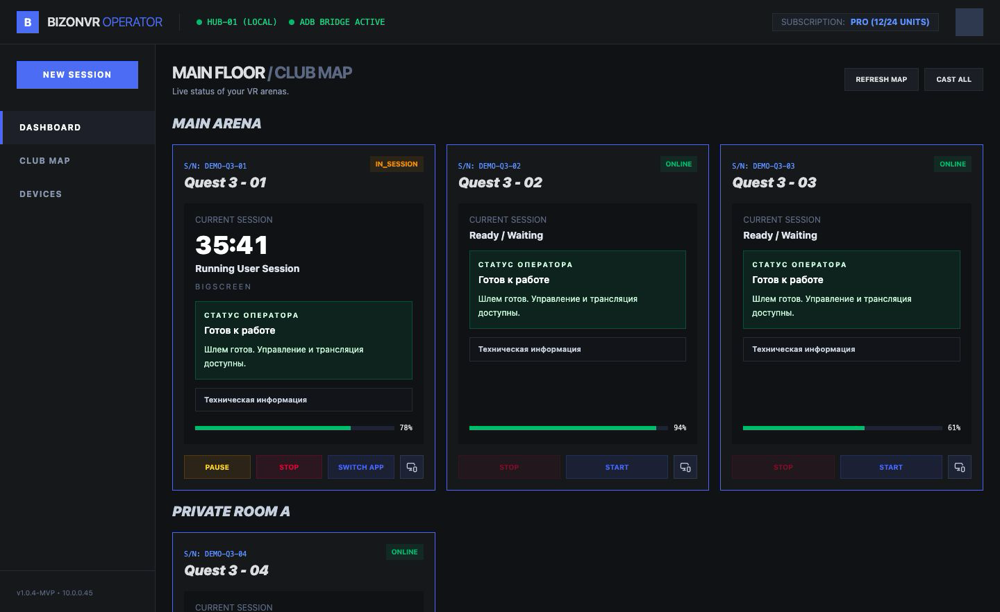
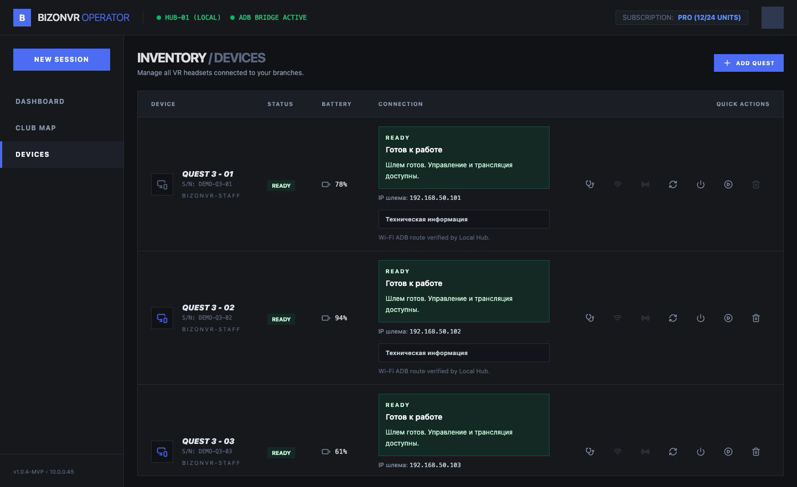
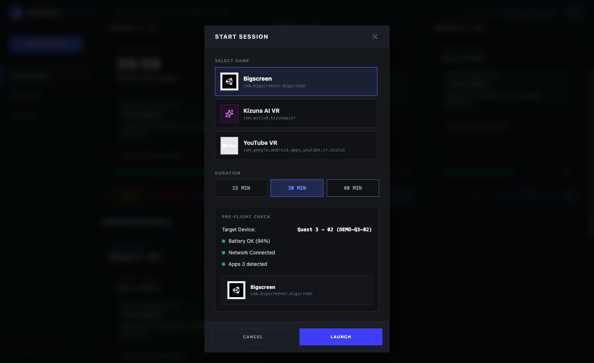
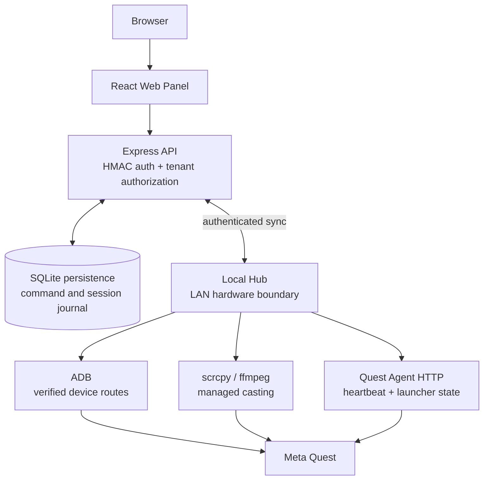

# BizonVR Operator

[](https://github.com/yarrobong/BizonVR-Operator/actions/workflows/ci.yml)

**Operations and device-management platform for VR clubs, built around real BizonVR-style operational workflows.**

BizonVR Operator is a portfolio-scale MVP for managing Meta Quest fleets from a single web interface. It combines club operations, device state, sessions, diagnostics, APK provisioning, casting, and a LAN-local hardware control layer without turning the cloud backend into a remote shell gateway.

> **Status:** the software path is implemented and covered by automated validation. Physical Meta Quest end-to-end validation and production deployment are intentionally not claimed yet.

**Stack:** React 19 · TypeScript · Vite · Express · SQLite · Node.js · Kotlin · Android SDK · ADB · scrcpy · ffmpeg · GitHub Actions

[Architecture](#architecture) · [Screenshots](#screenshots) · [Quick start](#quick-start) · [Documentation](#documentation-map)

---

## Why this project exists

Running a VR club is not just a dashboard problem. An operator needs to know which headset is usable, start and finish sessions safely, recover from unstable ADB/Wi-Fi routes, install approved APKs, cast device output, and understand why an action failed.

A cloud-only service cannot safely reach headsets inside a club LAN. A purely local tool, on the other hand, loses organization, authorization, subscription, audit, and durable workflow context.

BizonVR Operator separates those responsibilities into a cloud/API layer and a LAN-local execution layer.

## My role

This repository represents my end-to-end work on the system design and implementation of the operator platform. My focus includes:

- backend API and domain logic;
- React operator dashboard and device-management flows;
- Cloud API ↔ Local Hub orchestration;
- typed device commands and result reconciliation;
- ADB route management and hardware-adjacent automation;
- Quest Agent integration and credential provisioning;
- session lifecycle and reliability rules;
- casting process management;
- authentication, authorization, audit, and safety controls;
- automated tests, CI, architecture notes, and technical documentation.

The project is presented as a portfolio-scale MVP. The README distinguishes implemented software behavior from hardware and production claims that still require real-world validation.

## Screenshots

<p align="center">
  
</p>

<table>
  <tr>
    <td></td>
    <td></td>
  </tr>
</table>

The UI above uses local demo data. Physical Meta Quest end-to-end validation remains deferred.

## What it does

The current repository contains source and tests for:

- organizations, clubs, rooms, devices, Local Hubs, subscriptions, and audit logs;
- device health/status projections, Agent heartbeat ingestion, operator-call flow, and diagnostics;
- typed command creation, status transitions, cancellation, delivery claims, and result reconciliation;
- session start, pause, resume, extension, app switching, completion, and failure handling;
- app inventory and checksum-verified Quest Agent/APK installation commands;
- app launch/stop, launcher return, ADB repair/reconnect, and managed scrcpy casting;
- club-map and device-management screens built with React, TanStack Query, Zustand, and Tailwind.

These are code-level capabilities. Physical headset behavior is explicitly still pending validation.

## Architecture



The **Express API** owns authentication, authorization, durable state, command claiming, subscriptions, audit context, and session transitions.

The **Local Hub** is the hardware boundary. It polls and reconciles typed commands, then performs ADB, scrcpy, ffmpeg, and Quest Agent operations inside the club network.

The **Quest Agent** complements ADB with pairing-bound identity, heartbeat freshness, launcher/session state, player messaging, and operator-call flows.

Cloud code never runs arbitrary ADB or shell commands directly, and the UI cannot submit arbitrary shell input.

## Engineering highlights

### Cloud ↔ LAN orchestration

The system treats device control as a distributed workflow rather than a direct HTTP call. The Cloud API and Local Hub communicate through authenticated synchronization while hardware access remains local to the club network.

### Durable typed commands

Device actions use typed commands with idempotency keys, durable claims, leases, retries, result hashes, and reconciliation. Unknown outcomes remain visible instead of being blindly replayed after a lost response.

### Stable device identity

USB routes, Wi-Fi ADB routes, IP addresses, and Agent heartbeats can all change independently. The system keeps stable device identity separate from transient connection routes and supports route recovery.

### Session reliability

Session state uses durable timestamps, guarded transitions, one-active-session constraints, and confirmed cleanup before completion. Timers are not tied to a browser tab or page refresh.

### Safe APK provisioning

APK operations use approved artifact identities, containment/symlink checks, and SHA-256 verification before a filesystem path is allowed to reach ADB.

### Managed casting

Casting is treated as a process lifecycle: one producer per Quest, multiple viewers, bounded backpressure, fallback transport, and cleanup on abort, restart, or crash.

### Credential boundaries

Quest Agent provisioning keeps the raw Agent credential in a local mode-0600 cache while Cloud stores only its SHA-256 hash. Command/result payloads reject raw credentials, and audit/session data is recursively redacted.

## Technology stack

| Area | Implementation |
| --- | --- |
| Web panel | React 19, TypeScript, Vite, TanStack Query, Zustand, Tailwind CSS |
| Cloud/API | Node.js, Express 4, TypeScript, better-sqlite3, Zod |
| Local Hub | Node.js, ADB integration, scrcpy, ffmpeg, local credential storage, command reconciliation |
| Quest Agent | Android, Kotlin, Android SDK, Meta Spatial SDK path; no Unity |
| Quality | `node:test` via `tsx`, GitHub Actions, Gradle Android tests/build |

SQLite is the current repository runtime for the API, and the Local Hub keeps its own local cache/journal.

PostgreSQL, Redis, Django, Celery, and WebSocket infrastructure are **not** implemented in this repository and are not presented as part of the current stack.

## Security model

- Production Web API requests require signed HMAC Bearer tokens using `AUTH_SECRET`.
- The server resolves the token subject to an active user and enforces organization/club scope, role permissions, subscription features, and device limits.
- Local Hub transport uses Hub credentials.
- Quest Agent credentials are pairing-bound and compared in constant time.
- The Hub stores the raw Agent credential in a local mode-0600 cache; Cloud persists only the SHA-256 hash.
- Heartbeats require a fresh, monotonic timestamp and a matching device identity.
- Command and result JSON rejects raw credentials, while audit/session data is recursively redacted.
- APK operations accept approved artifact IDs and verify containment, symlinks, and SHA-256 before ADB.
- Request bodies and ADB/process output have explicit size limits.
- Database migrations run transactionally.

Development-only authentication fallbacks are explicit environment flags and must not be enabled in production.

This project makes no formal security-certification claim.

## Reliability model

The command journal is durable at both the Cloud/API and Local Hub boundaries.

Commands are:

- claimed with leases;
- serialized per stable device identity;
- retried only under semantic policies;
- reconciled after uncertain outcomes.

Session state uses durable timestamps, guarded transitions, one-active-session constraints, and confirmed cleanup before completion.

Restart recovery, ADB route replacement, offline buffering, and cast-process cleanup are covered by fault-oriented tests.

Detailed design notes:

- [Backend architecture](docs/backend-architecture.md)
- [Local Hub architecture](docs/local-hub-architecture.md)
- [ADB reliability](docs/adb-reliability.md)
- [Session reliability](docs/session-reliability.md)
- [Cast reliability](docs/cast-reliability.md)
- [Security hardening](docs/security-hardening.md)

## Quick start

### Web/API development

```bash
npm ci
npm run dev
```

The API listens on `http://localhost:3000`.

Copy [.env.example](.env.example) only when local configuration is required. `AUTH_SECRET` is required for production signed authentication. The development fallback is intentionally opt-in and is intended only for local API/test use.

### Local Hub

```bash
npm run hub:dev
```

The Hub expects:

```text
APP_URL=http://localhost:3000
```

It uses port `3001` by default and requires locally installed `adb`. Casting additionally requires `scrcpy` and `ffmpeg`.

### Android Quest Agent

Build the debug APK when testing APK installation:

```bash
cd quest-agent-spatial-spike
./gradlew assembleDebug
cd ..
```

### Verification

Useful verification commands:

```bash
npm run lint
npm test
npm run build
npm run hub
```

There is no physical-device prerequisite for the automated suite.

## Project structure

```text
src/
  backend/          Express routes, services, and repositories
  components/       Shared React layout
  pages/            Map, devices, and casting screens

db/migrations/      API SQLite schema migrations

local-hub/
  agent/            Quest Agent HTTP/auth/provisioning
  commands/         Typed dispatch, workers, reconciliation
  devices/          Identity, ADB routes, diagnostics, app discovery
  cast/             scrcpy/ffmpeg stream service

quest-agent-spatial-spike/
  app/src/          Kotlin Quest Agent and soft-launcher implementation

tests/              Node, security, reliability, migration, and UI helper tests
docs/               Architecture, CI, reliability, security, and test plans
```

## Testing and CI

The verified baseline is **134 Node tests across 23 suites**.

GitHub Actions exposes two required checks:

- **Node / verify** — `npm ci`, TypeScript validation, all Node tests, production build, Local Hub JavaScript syntax checks, and HIGH/CRITICAL npm audit gates.
- **Android / verify** — Gradle unit tests and `assembleDebug` using the repository wrapper.

CI runs in Ubuntu/Java/Node environments and does not use ADB, an emulator, or physical Quest hardware.

See [docs/ci.md](docs/ci.md) for workflow details.

## Current validation status

### Verified

- Node test suite: **134 tests, 23 suites**;
- backend authorization and tenant isolation;
- command/session reliability behavior;
- APK safety and audit behavior;
- frontend production build;
- Local Hub JavaScript syntax;
- Android unit/build validation for `quest-agent-spatial-spike`;
- GitHub Actions workflow definitions and required check names.

### Not yet verified

- full end-to-end operation on physical Meta Quest hardware;
- production deployment;
- production-scale multi-club load behavior.

The Android project name `quest-agent-spatial-spike` is retained to avoid unnecessary Gradle/package churn. It is the current Quest app path in this repository, with the historical name called out explicitly.

## Documentation map

- [Portfolio summary](docs/portfolio-summary.md) — interview-ready overview of the problem, architecture, decisions, and validation.
- [CI](docs/ci.md) — workflow behavior and branch-protection checks.
- [Architecture](docs/architecture.md) — current runtime boundaries and storage responsibilities.
- [Database design](docs/database.md) — current SQLite schema/runtime and migration notes.
- [Device commands](docs/commands.md) — typed command contract and safety rules.
- [Backend architecture](docs/backend-architecture.md) — API responsibilities and boundaries.
- [Local Hub architecture](docs/local-hub-architecture.md) — LAN-local execution model.
- [ADB reliability](docs/adb-reliability.md) — device routing and recovery behavior.
- [Session reliability](docs/session-reliability.md) — session state and failure handling.
- [Cast reliability](docs/cast-reliability.md) — casting lifecycle and recovery.
- [Security hardening](docs/security-hardening.md) — authentication, authorization, credential, and payload protections.
- [Hardware test plans](docs/adb-hardware-test-plan.md) and [session hardware test plan](docs/session-hardware-test-plan.md) — future physical validation procedures.

## Scope and limitations

This is a Meta Quest MVP.

The following are intentionally out of scope for the current repository:

- Pico support;
- Unity-based Agent code;
- direct Cloud-to-Quest control;
- arbitrary shell execution;
- consumer-Quest full kiosk guarantees.

The repository does **not** claim:

- physical Quest E2E validation;
- production deployment;
- production-scale load testing.

Those claims should only be added after real-device and deployment evidence exists.
